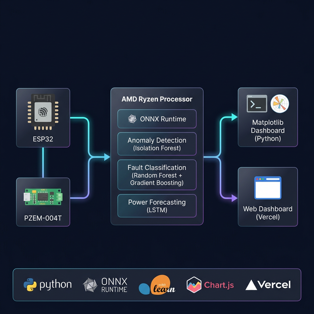
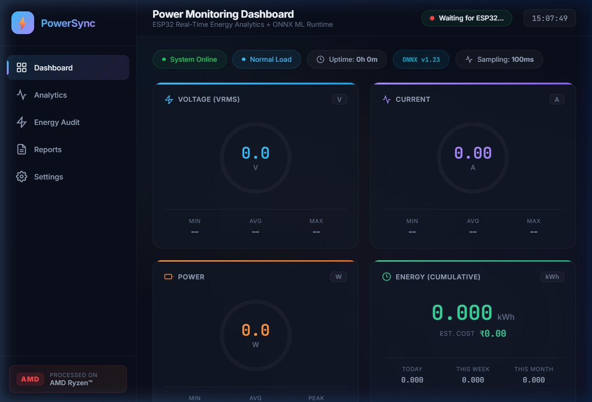
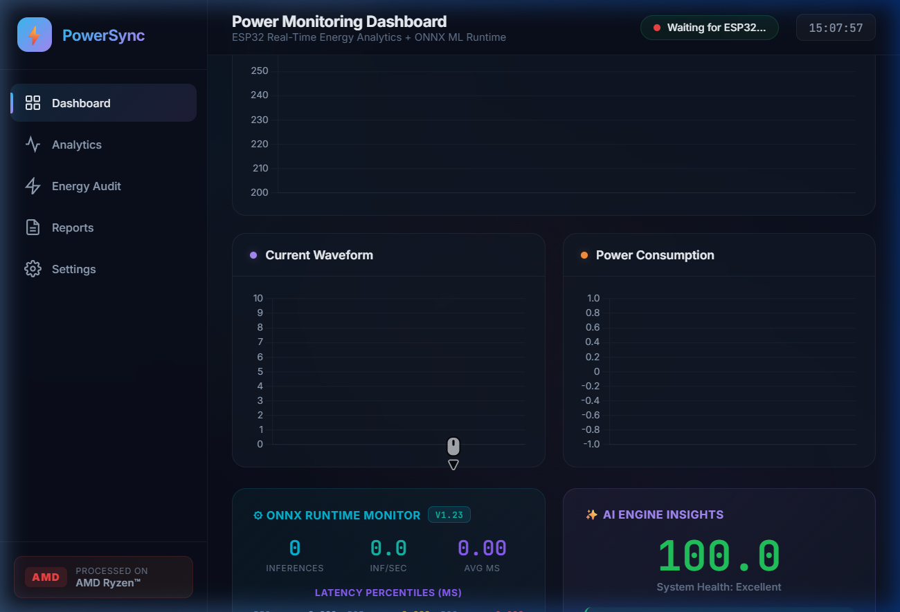

<p align="center">
  
</p>

<h1 align="center">⚡ PowerSync — Smart Power Monitoring with Edge AI</h1>

<p align="center">
  <b>Real-time power monitoring + ML-powered fault detection on AMD Ryzen™ with ONNX Runtime</b>
</p>

<p align="center">
  
  
  
  
  
</p>

<p align="center">
  <a href="https://amd-gilt.vercel.app/">🌐 Live Demo</a> &nbsp;·&nbsp;
  <a href="#-features">Features</a> &nbsp;·&nbsp;
  <a href="#-tech-stack">Tech Stack</a> &nbsp;·&nbsp;
  <a href="#-getting-started">Setup</a>
</p>

---

## 🎯 Problem Statement

Traditional power monitoring systems provide only raw voltage/current readings without any intelligence. Users can't detect faults, predict failures, or optimize energy consumption until something breaks. We built **PowerSync** to solve this — a complete edge-AI power monitoring platform that detects anomalies and classifies faults **in real-time** using ONNX-accelerated ML models on AMD hardware.

---

## 💡 What is PowerSync?

PowerSync is an end-to-end smart power monitoring system that combines:

- **Hardware:** ESP32 microcontroller + PZEM-004T energy sensor reading real AC power lines
- **Edge AI:** ML models (anomaly detection, fault classification) converted to ONNX format for fast inference on AMD Ryzen™ processors
- **Dual Dashboards:** A Python Matplotlib real-time dashboard + a web dashboard deployed on Vercel

The system reads voltage, current, and power from the sensor at **100ms intervals**, runs the data through ONNX-optimized ML models, and displays live insights including health scores, fault alerts, and energy cost tracking.

---

## ✨ Features

| Feature | Description |
|---------|-------------|
| ⚡ **Real-Time Monitoring** | Live voltage (V), current (A), power (W), and energy (kWh) tracking at 100ms sampling rate |
| 🧠 **Anomaly Detection** | Isolation Forest model detects unusual power patterns using ensemble scoring |
| 🔍 **Fault Classification** | Random Forest + Gradient Boosting ensemble classifies 7 fault types (overvoltage, undervoltage, overcurrent, etc.) |
| 🚀 **ONNX Acceleration** | ML models converted to ONNX format for optimized inference on AMD processors |
| 📊 **Performance Monitor** | Real-time ONNX latency tracking — P50, P95, P99 percentiles, throughput (inf/sec) |
| 💚 **System Health Score** | Composite 0–100 health score based on voltage stability, current safety, anomaly rate |
| 💰 **Energy Cost Tracking** | Cumulative kWh tracking with configurable ₹/kWh cost estimation |
| 📈 **Power Analytics** | 24h power distribution, voltage stability scatter, load profile breakdown |
| 📄 **CSV Reports** | Downloadable daily/monthly/full audit reports |
| 🌐 **Web Dashboard** | Responsive web UI deployed on Vercel — works on any device |

---

## 📸 Screenshots

### Web Dashboard — Gauge Cards
<p align="center">
  
</p>

> Real-time radial gauges for Voltage, Current, Power, and Energy with Min/Avg/Max tracking and cumulative cost estimation.

### Web Dashboard — ONNX Monitor & AI Insights
<p align="center">
  
</p>

> Live ONNX Runtime performance panel with latency percentiles and sparkline chart, alongside AI Engine health scoring and fault alerts.

---

## 🏗️ Architecture

```
┌──────────────┐     Serial/USB      ┌─────────────────────────────────────────────┐
│   ESP32 MCU  │ ──────────────────► │           AMD Ryzen™ Processor              │
│  PZEM-004T   │    115200 baud      │                                             │
│  AC Sensor   │                     │  ┌─────────────────────────────────────┐    │
└──────────────┘                     │  │         ONNX Runtime v1.23          │    │
                                     │  │                                     │    │
                                     │  │  ┌──────────┐  ┌────────────────┐  │    │
                                     │  │  │ Anomaly  │  │    Fault       │  │    │
                                     │  │  │ Detector │  │  Classifier    │  │    │
                                     │  │  │(IsoForest│  │(RF + GBM)     │  │    │
                                     │  │  └──────────┘  └────────────────┘  │    │
                                     │  └─────────────────────────────────────┘    │
                                     │                                             │
                                     │  ┌──────────────┐  ┌───────────────────┐   │
                                     │  │  Insights    │  │  Feature          │   │
                                     │  │  Engine      │  │  Engineer         │   │
                                     │  │ (Health/Rec) │  │  (45 features)    │   │
                                     │  └──────────────┘  └───────────────────┘   │
                                     └──────────────┬──────────────┬──────────────┘
                                                    │              │
                                       ┌────────────▼──┐   ┌──────▼──────────┐
                                       │  Matplotlib   │   │ Web Dashboard   │
                                       │  Dashboard    │   │ (Vercel)        │
                                       │  (Python)     │   │ HTML/CSS/JS     │
                                       └───────────────┘   └─────────────────┘
```

---

## 🛠️ Tech Stack

| Layer | Technology |
|-------|-----------|
| **Sensor** | ESP32 + PZEM-004T (AC voltage/current/power/energy) |
| **ML Models** | scikit-learn (Isolation Forest, Random Forest, Gradient Boosting) |
| **ML Runtime** | ONNX Runtime 1.23 (CPUExecutionProvider on AMD Ryzen™) |
| **Backend** | Python 3.13, NumPy, Matplotlib |
| **Frontend** | HTML5, CSS3 (glassmorphism dark theme), JavaScript, Chart.js 4.4 |
| **Deployment** | Vercel (static hosting) |
| **Conversion** | skl2onnx, onnxmltools |

---

## 📁 Project Structure

```
AMD_Hackathon/
│
├── power_dashboard.py          # Main Python dashboard (Matplotlib + ONNX ML)
├── test_onnx_pipeline.py       # ONNX pipeline validation test
├── vercel.json                 # Root Vercel deployment config
│
├── ml_models/                  # ML package
│   ├── __init__.py             # Package exports
│   ├── config.py               # Configuration (thresholds, costs, weights)
│   ├── feature_engineer.py     # 45-feature extraction from sensor data
│   ├── anomaly_detector.py     # Isolation Forest anomaly detection
│   ├── fault_classifier.py     # RF + GBM fault classification (7 classes)
│   ├── power_forecaster.py     # LSTM power forecasting
│   ├── insights_engine.py      # Health scoring & recommendations
│   ├── onnx_converter.py       # ONNX model converter + performance monitor
│   ├── model_manager.py        # Model orchestrator (load/train/save)
│   └── data_generator.py       # Synthetic training data generator
│
├── web-dashboard/              # Vercel-deployable web dashboard
│   ├── public/
│   │   ├── index.html          # Dashboard UI (gauges, charts, ONNX panel)
│   │   ├── app.js              # Chart.js logic + ESP32 integration API
│   │   └── style.css           # Dark theme with glassmorphism
│   ├── vercel.json
│   ├── package.json
│   └── README.md
│
└── assets/                     # Screenshots for README
    ├── architecture.png
    ├── web_dashboard_gauges.png
    └── web_dashboard_onnx.png
```

---

## 🚀 Getting Started

### Prerequisites

- Python 3.10+
- AMD processor (recommended for optimal ONNX performance)
- ESP32 with PZEM-004T sensor (optional — works with built-in data engine too)

### 1. Install Dependencies

```bash
pip install numpy matplotlib scikit-learn onnxruntime skl2onnx onnxmltools
```

### 2. Run the Python Dashboard

```bash
python power_dashboard.py
```

This starts the Matplotlib dashboard with:
- Live sensor data reading (or built-in SensorDataEngine)
- ONNX-accelerated ML inference
- Real-time anomaly/fault detection
- ONNX Runtime performance monitoring

### 3. Deploy the Web Dashboard

```bash
cd web-dashboard
npx vercel --prod
```

Or visit the live deployment: **[https://amd-gilt.vercel.app/](https://amd-gilt.vercel.app/)**

---

## 🧠 ML Models

### Anomaly Detection
- **Algorithm:** Isolation Forest + Z-score + Moving Average ensemble
- **Input:** 45 engineered features from voltage/current/power windows
- **Output:** Anomaly score (0–1) with configurable sensitivity threshold

### Fault Classification
- **Algorithm:** Random Forest + Gradient Boosting ensemble
- **Classes:** Normal, Overvoltage, Undervoltage, Overcurrent, Overload, Power Factor Issue, Ground Fault
- **Output:** Fault ID + confidence score + top-3 predictions

### ONNX Conversion
All sklearn models are converted to ONNX format using `skl2onnx` for optimized inference:
- **~2-5x faster** inference vs raw sklearn `.predict()`
- Models cached in `saved_models/onnx/` — conversion happens only once
- Real-time latency tracking: P50, P95, P99 percentiles

---

## 📊 ONNX Performance Metrics

The dashboard tracks these ONNX Runtime metrics in real-time:

| Metric | Description |
|--------|-------------|
| Total Inferences | Cumulative count of ML inference calls |
| Throughput | Inferences per second (inf/s) |
| Avg Latency | Mean inference time in milliseconds |
| P50 / P95 / P99 | Latency percentiles for tail performance analysis |
| Per-Model Breakdown | Individual model latency (anomaly_detector, fault_rf, fault_gb) |
| Error Count | ONNX session failures tracked for reliability |

---

## 🔗 ESP32 Integration

The web dashboard provides three integration methods:

```javascript
// Option 1: WebSocket
const ws = new WebSocket('ws://ESP32_IP/ws');
ws.onmessage = (e) => {
    const d = JSON.parse(e.data);
    updateFromESP32(d.voltage, d.current, d.power);
};

// Option 2: HTTP Polling
setInterval(async () => {
    const res = await fetch('http://ESP32_IP/data');
    const data = await res.json();
    updateFromESP32(data.voltage, data.current, data.power);
}, 1000);

// Option 3: Web Serial API (Chrome)
// Direct USB serial connection from browser
```

---

## 👥 Team

Built for the **AMD Pervasive AI Developer Contest** hackathon.

---

<p align="center">
  <b>Processed on AMD Ryzen™ · ONNX Runtime v1.23 · Made with ❤️</b>
</p>
